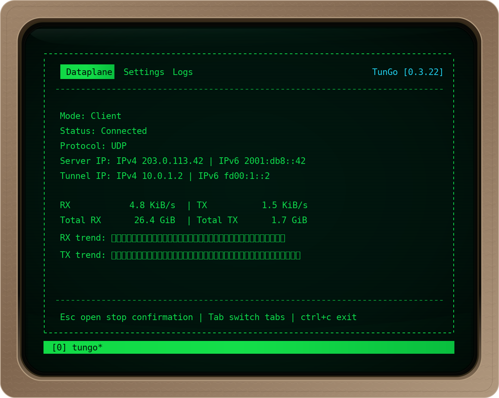

[](https://codecov.io/gh/NLipatov/TunGo)
[](./LICENSE)


# TunGo: What's It All About?

<p align="center">
  
</p>

**TunGo** is a lightweight VPN designed for modern needs: **fast**, **secure**, and **open-source**.

<p align="center">
  <a href="https://tungo.ethacore.com/docs/QuickStart"><strong>Install and configure</strong></a>
  ·
  <a href="https://github.com/NLipatov/TunGo/releases/latest">Download binaries</a>
  ·
  <a href="https://tungo.ethacore.com">Documentation</a>
</p>

## Features

- UDP, TCP and WebSocket transports
- **0 allocs/packet** on the dataplane hot path
- Interactive TUI for Linux, macOS and Windows

---

## Performance

In-memory dataplane benchmark with 1400-byte packets on an Apple M4 Pro:

| Path | Time/packet | Throughput | Allocs/packet |
|---|---:|---:|---:|
| UDP client → server | ~2.7 µs | ~4.3 Gbit/s | 0 |
| UDP server → client | ~2.6 µs | ~4.3 Gbit/s | 0 |
| TCP client → server | ~2.6 µs | ~4.3 Gbit/s | 0 |
| TCP server → client | ~2.6 µs | ~4.3 Gbit/s | 0 |

> Covers encryption, routing, validation and decryption. Excludes TUN,
> sockets, kernel, firewall/NAT and network I/O; not end-to-end VPN throughput.

<details>
<summary>Reproduce the benchmark</summary>

```bash
cd src
go test ./infrastructure/tunnel/dataplane/server/udp_chacha20 ./infrastructure/tunnel/dataplane/client/udp_chacha20 ./infrastructure/tunnel/dataplane/server/tcp_chacha20 ./infrastructure/tunnel/dataplane/client/tcp_chacha20 -run '^$' -bench FullCycle -benchmem
```

</details>
